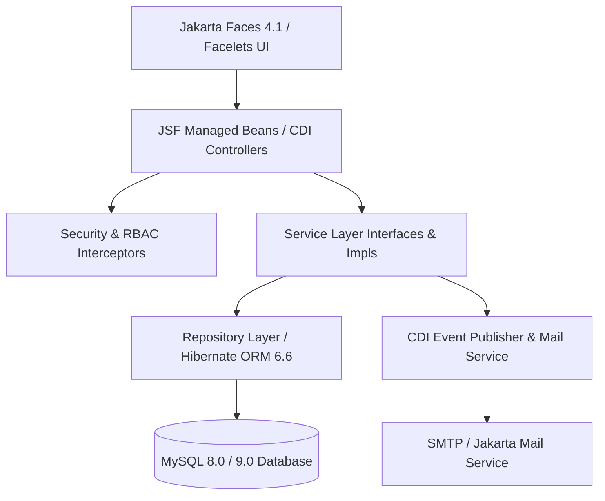

# 🏦 Kimwanyi SACCO — Enterprise Management System

[](https://www.oracle.com/java/)
[](https://jakarta.ee/)
[](https://hibernate.org/)
[](https://jakarta.ee/specifications/faces/)
[](https://www.mysql.com/)
[](LICENSE)

**Kimwanyi SACCO** is an enterprise-grade Savings and Credit Co-operative Society (SACCO) Management System built with **Java 17**, **Jakarta EE 10**, **Jakarta Faces (JSF 4)**, and **Hibernate ORM 6.6**. 

It provides robust, secure financial operations including member management, savings account lifecycle, loan origination and repayment tracking, double-entry ledger accounting, multi-channel notifications, and comprehensive system auditing.

---

## 📋 Table of Contents

- [Features](#-features)
- [Architecture & Tech Stack](#-architecture--tech-stack)
- [Prerequisites](#-prerequisites)
- [Project Structure](#-project-structure)
- [Environment Configuration](#-environment-configuration)
- [Database Setup](#-database-setup)
- [Getting Started & Running](#-getting-started--running)
- [Testing](#-testing)
- [Security & Role-Based Access Control](#-security--role-based-access-control)
- [License](#-license)

---

## ✨ Features

### 👥 Member Management
- **Member Onboarding & KYC**: Complete record-keeping for members including contact info, status management (`ACTIVE`, `INACTIVE`, `SUSPENDED`), and gender demographics.
- **Self-Service & Admin Portals**: Dedicated member views and administrative controls for member oversight.

### 💰 Savings Accounts & Transactions
- **Flexible Savings Accounts**: Account creation, interest calculations, balance tracking, and status controls (`ACTIVE`, `FROZEN`, `CLOSED`).
- **Real-Time Transaction Engine**: Deposits, withdrawals, transfers, and interest credits with validation against account limits and balance thresholds.

### 📊 Loan Lifecycle Management
- **End-to-End Origination**: Loan applications (`DRAFT` $\rightarrow$ `PENDING` $\rightarrow$ `APPROVED` / `REJECTED` $\rightarrow$ `DISBURSED` $\rightarrow$ `ACTIVE` $\rightarrow$ `FULLY_PAID`).
- **Automated Repayment Schedules**: Principal and interest calculation engine.
- **Repayment Tracking**: Real-time payment processing, status updates (`PAID`, `PARTIAL`, `OVERDUE`), and delinquency flagging.

### 📖 Double-Entry General Ledger
- **Financial Integrity**: Full double-entry accounting model using `LedgerAccount`, `JournalEntry`, and `JournalLine`.
- **Balancing Enforcement**: Strict debit and credit equality rules for financial transparency and compliance.

### 🔔 Notifications & Email Verification
- **Multi-Channel Delivery**: In-app notification center coupled with transactional email delivery via Jakarta Mail (Angus Mail).
- **Email Token Verification**: Time-bound email confirmation tokens for secure user registration and password recovery workflows.

### 🛡️ Audit Logging & Analytics
- **System Audit Trail**: Complete action history tracking (`CREATE`, `UPDATE`, `DELETE`, `LOGIN`, `APPROVAL`, `DISBURSEMENT`) with timestamps, actor IDs, and payload changes.
- **Interactive Dashboards**: Financial statistics, member demographics, and loan performance visual charts powered by JSF and Chart.js.

---

## 🛠️ Architecture & Tech Stack



### Core Technologies

| Layer | Component / Technology |
| :--- | :--- |
| **Language & JDK** | Java 17 (LTS) |
| **Web Framework** | Jakarta EE 10 / Jakarta Servlet 6.1 |
| **UI Component Model** | Jakarta Faces (JSF 4.1 / 4.0.5) + Facelets |
| **Dependency Injection** | Jakarta CDI 4.0 (Weld Servlet Core 5.1.2) |
| **Persistence / ORM** | Hibernate ORM 6.6.15.Final + JPA 3.1 |
| **Database** | MySQL 8.0+ / Connector/J 9.3.0 |
| **Bean Validation** | Jakarta Validation 3.1 + Hibernate Validator 8.0 |
| **Security** | jBCrypt 0.4 (Password Hashing) + Custom RBAC |
| **Mailing** | Jakarta Mail 2.1 + Angus Mail 2.0 |
| **Logging** | SLF4J 2.0 + Logback 1.5 |
| **Embedded Server** | Apache Tomcat 10.1 (via Cargo Maven Plugin 1.10) |
| **Build Tool** | Apache Maven 3.8+ (`mvnw` wrapper included) |

---

## ⚙️ Prerequisites

Before building and running the project, ensure you have the following installed on your machine:

- **Java Development Kit (JDK)**: Version 17 or higher (`java -version`)
- **Apache Maven**: Version 3.8+ or use the provided `./mvnw` script
- **MySQL Server**: Version 8.0 or higher running on port `3306`
- **Git**: For version control

---

## 📂 Project Structure

```text
kimwanyi-sacco/
├── .env.example                # Sample environment configuration file
├── pom.xml                     # Maven project descriptor & dependencies
├── mvnw / mvnw.cmd             # Maven Wrapper scripts
├── src/
│   ├── main/
│   │   ├── java/org/kimwanyi/sacco/
│   │   │   ├── audit/          # Audit logging entities, repositories & services
│   │   │   ├── bean/           # JSF Managed Beans (@Named, @ViewScoped, @RequestScoped)
│   │   │   ├── config/         # System configurations & CDI producers
│   │   │   ├── dto/            # Data Transfer Objects
│   │   │   ├── entity/         # Hibernate JPA Entities (Member, Savings, Loan, Ledger, etc.)
│   │   │   ├── enums/          # System Enums (LoanStatus, AccountStatus, AuditAction, etc.)
│   │   │   ├── event/          # CDI Events & Listeners
│   │   │   ├── exception/      # Domain-specific custom exceptions
│   │   │   ├── factory/        # Object factories
│   │   │   ├── filter/         # Servlet Filters (Authentication & Security headers)
│   │   │   ├── finance/        # Financial calculation utilities & models
│   │   │   ├── listener/       # Servlet & Context listeners
│   │   │   ├── mapper/         # DTO / Entity Mappers
│   │   │   ├── repository/     # Data Access Object (DAO) interfaces
│   │   │   ├── repositoryImpl/ # Hibernate DAO implementations
│   │   │   ├── security/       # Password encoders, policies & session validators
│   │   │   ├── service/        # Business service interfaces
│   │   │   ├── serviceImpl/    # Core business service implementations
│   │   │   ├── util/           # Helper utilities (Email, Date, Math, Session)
│   │   │   └── validation/     # Custom annotations & validators
│   │   ├── resources/
│   │   │   ├── hibernate.cfg.xml # Hibernate ORM database configuration
│   │   │   └── logback.xml       # Logback logging layout configuration
│   │   └── webapp/
│   │       ├── WEB-INF/
│   │       │   ├── beans.xml   # CDI Enablement Descriptor
│   │       │   ├── web.xml     # Deployment Descriptor (JSF FacesServlet configuration)
│   │       │   └── templates/  # Facelets Master Layout Templates
│   │       ├── dashboard.xhtml # Main Dashboard View
│   │       ├── members.xhtml   # Member Directory & Onboarding View
│   │       ├── savings.xhtml   # Savings Accounts & Transactions Management
│   │       ├── loans.xhtml     # Loan Applications & Repayment Processing
│   │       ├── ledger.xhtml    # Double-Entry General Ledger View
│   │       ├── audit.xhtml     # System Audit Log Explorer
│   │       ├── login.xhtml     # User Authentication View
│   │       ├── register.xhtml  # Member & User Registration
│   │       └── resources/      # CSS, JS (app.js), and static assets
│   └── test/
│       └── java/org/kimwanyi/sacco/service/  # Unit & Integration Tests
```

---

## 🔧 Environment Configuration

1. Copy `.env.example` to `.env` in the root directory:
   ```bash
   cp .env.example .env
   ```

2. Open `.env` and configure your SMTP and environment settings:
   ```env
   # SMTP Server Configuration
   MAIL_SMTP_HOST=smtp.gmail.com
   MAIL_SMTP_PORT=587
   MAIL_SMTP_AUTH=true
   MAIL_SMTP_STARTTLS=true
   MAIL_FROM=noreply@kimwanyi-sacco.org
   MAIL_SMTP_USERNAME=your-email@gmail.com
   MAIL_SMTP_PASSWORD=your-app-password
   ```

3. Export environment variables prior to running the application:
   ```bash
   set -a && source .env && set +a
   ```

---

## 🗄️ Database Setup

1. Start your local **MySQL** server.
2. Create the database schema:
   ```sql
   CREATE DATABASE IF NOT EXISTS kimwanyi_sacco 
   CHARACTER SET utf8mb4 
   COLLATE utf8mb4_unicode_ci;
   ```
3. Update database credentials in `src/main/resources/hibernate.cfg.xml` if needed:
   ```xml
   <property name="hibernate.connection.url">jdbc:mysql://localhost:3306/kimwanyi_sacco</property>
   <property name="hibernate.connection.username">YOUR_DB_USER</property>
   <property name="hibernate.connection.password">YOUR_DB_PASSWORD</property>
   ```
   *Note: `hibernate.hbm2ddl.auto` is configured to `update`, so database tables will be automatically generated upon application launch.*

---

## 🚀 Getting Started & Running

### Option 1: Embedded Tomcat 10 (Cargo Plugin — Recommended)

Run the embedded Tomcat server on port `8085` using the Maven wrapper:

```bash
./mvnw clean cargo:run
```

Once started, access the web application at:
👉 **`http://localhost:8085/kimwanyi-sacco`**

---

### Option 2: Build WAR & Deploy to External Container

To package the application into a standalone `.war` file for deployment to Apache Tomcat 10+, GlassFish 7+, or Payara 6+:

1. Package the WAR:
   ```bash
   ./mvnw clean package
   ```
2. The generated WAR file will be located at:
   ```text
   target/kimwanyi-sacco.war
   ```
3. Copy `target/kimwanyi-sacco.war` into your application server's `webapps/` directory and start the server.

---

## 🧪 Testing

Execute all automated unit and integration tests (Loan calculations, Email service, Savings rules, Ledger balance checks) using Maven:

```bash
./mvnw clean test
```

Test reports are generated in `target/surefire-reports/`.

---

## 🔒 Security & Role-Based Access Control

- **Password Hashing**: Passwords are securely hashed using `BCrypt` with standard work factor salt rounds.
- **Granular Permissions**: Role-based access control (RBAC) enforces privileges across key domains:
  - `MEMBER_READ` / `MEMBER_WRITE`
  - `SAVINGS_READ` / `SAVINGS_WRITE` / `SAVINGS_TRANSACT`
  - `LOAN_APPLY` / `LOAN_APPROVE` / `LOAN_DISBURSE`
  - `LEDGER_VIEW` / `LEDGER_POST`
  - `AUDIT_VIEW`
- **Email Verification**: User registration triggers time-sensitive token generation sent via email to confirm valid identity before account activation.

---

## 📄 License

This project is licensed under the **MIT License**. See the `LICENSE` file for details.

---

<p align="center">
  Built with ❤️ for <b>Kimwanyi SACCO</b>
</p>
